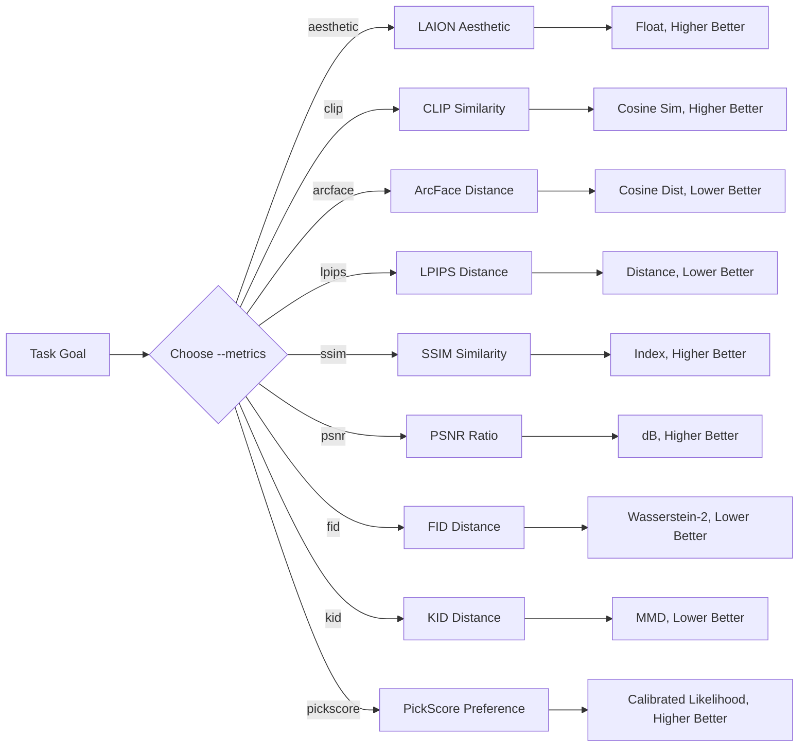

# image-evaluator

`image-evaluator` is a lightweight CLI utility for generative AI practitioners and researchers. It evaluates nine core quality dimensions of synthetic images: predicted visual aesthetics, text-to-image semantic alignment, facial identity preservation, pairwise image fidelity (deep perceptual distance LPIPS, structural similarity SSIM, and peak signal-to-noise ratio PSNR), dataset distribution fidelity (Fréchet Inception Distance FID and Kernel Inception Distance KID), and human preference alignment (PickScore).

## Evaluation Workflow



## Metric Selection

| Target Goal | Metric Name | Required Options | Output Direction | Technical Details |
| :--- | :--- | :--- | :--- | :--- |
| Visual appeal & quality | `aesthetic` | `--image` | Higher is better | [docs/aesthetic-score.md](docs/aesthetic-score.md) |
| Prompt semantic match | `clip` | `--image`, `--prompt` | Higher is better | [docs/clip-similarity.md](docs/clip-similarity.md) |
| Facial identity consistency | `arcface` | `--image`, `--reference` | Lower is better | [docs/arcface-distance.md](docs/arcface-distance.md) |
| Deep perceptual similarity | `lpips` | `--image`, `--reference` | Lower is better | [docs/pairwise-fidelity.md](docs/pairwise-fidelity.md) |
| Structural degradation | `ssim` | `--image`, `--reference` | Higher is better | [docs/pairwise-fidelity.md](docs/pairwise-fidelity.md) |
| Pixel reconstruction SNR | `psnr` | `--image`, `--reference` | Higher is better | [docs/pairwise-fidelity.md](docs/pairwise-fidelity.md) |
| Population distribution distance | `fid` | `--image <dir>`, `--reference <dir>` | Lower is better | [docs/fid.md](docs/fid.md) |
| Unbiased kernel MMD distance | `kid` | `--image <dir>`, `--reference <dir>` | Lower is better | [docs/kid.md](docs/kid.md) |
| Human preference & alignment | `pickscore` | `--image`, `--prompt` | Higher is better | [docs/pickscore.md](docs/pickscore.md) |

## Quick Start

### Installation

`image-evaluator` requires Python 3.11–3.14. Install the release via pip:

```bash
python -m pip install image-evaluator==0.2.0
```

The supported runtime path is macOS or Linux with CPU ONNX Runtime. Linux
users who want the GPU runtime can replace `onnxruntime` with
`onnxruntime-gpu` after installation. Windows is currently unverified.

### Tutorial

The CLI enforces explicit metric selection via `--metrics` and initializes only selected models:
- `--metrics` (required): One or more of `aesthetic`, `clip`, `arcface`, `lpips`, `ssim`, `psnr`, `fid`, `kid`, `pickscore`.
- `--image` (required): Path to an image file or directory (must be a directory when `fid` or `kid` is selected).
- `--prompt`: Required when `clip` or `pickscore` is selected; prohibited otherwise.
- `--reference`: Required when reference-based metrics (`arcface`, `lpips`, `ssim`, `psnr`, `fid`, `kid`) are selected; prohibited otherwise (must be a directory when `fid` or `kid` is selected).

1. **Aesthetic evaluation only**:
   ```bash
   image-evaluator --metrics aesthetic --image path/to/image.png
   ```

2. **CLIP text alignment only**:
   ```bash
   image-evaluator --metrics clip --image path/to/image.png --prompt "a cat in oil painting style"
   ```

3. **Pairwise fidelity triad (LPIPS, SSIM, PSNR)**:
   ```bash
   image-evaluator --metrics lpips ssim psnr --image path/to/image.png --reference path/to/ref.png
   ```

4. **Dataset distribution metrics (FID and KID)**:
   ```bash
   image-evaluator --metrics fid kid \
       --reference path/to/real_images/ \
       --image path/to/generated_images/
   ```

5. **Fidelity triad and distribution joint evaluation**:
   ```bash
   image-evaluator --metrics lpips ssim psnr fid kid \
       --reference path/to/reference_dir/ \
       --image path/to/generated_dir/
   ```

6. **PickScore human preference evaluation**:
   ```bash
   image-evaluator --metrics pickscore \
       --image path/to/image.png \
       --prompt "a cat in oil painting style"
   ```

7. **Multi-metric evaluation across folders**:
   ```bash
   image-evaluator --metrics aesthetic clip arcface lpips ssim psnr fid kid pickscore \
       --image path/to/images/ \
       --prompt "a cat in oil painting style" \
       --reference path/to/refs/
   ```

## Interpretation & Protocol Guidelines

1. **Protocol Consistency**: Always compare scores under identical model backbones and preprocessing pipelines.
2. **Relative Comparison**: Avoid universal absolute thresholds; interpret scores relative to a baseline control.
3. **Fail-Fast Spatial Dimension Policy**: Pairwise metrics (`lpips`, `ssim`, `psnr`) strictly reject mismatched image dimensions with `ValueError` to prevent artificial interpolation distortion. Align sizes beforehand via downsampling or super-resolution.
4. **SSIM Minimum Size**: SSIM requires both image dimensions to be at least 11 pixels because it uses the documented 11 × 11 Gaussian window. Smaller inputs fail with `ValueError`.
5. **Dataset Distribution Contract**: Both `fid` and `kid` require existing directories on both sides; passing single files is rejected immediately. Neither metric requires filename stem matching ($N_{\text{ref}} \ne N_{\text{gen}}$ is allowed).
6. **Sample Size Sensitivity & Unbiasedness**: FID is a biased estimator that overestimates distance on small sample sets ($N < 2048$, triggering a `UserWarning`). KID is an unbiased U-statistic estimator that can produce finite negative values near zero; these values reflect sample variance around zero and must not be truncated. KID defaults to deterministic `seed=0` for bit-exact reproducibility.
7. **Human Preference Alignment**: PickScore assesses text-image alignment against trained human preference choices from the Pick-a-Pic dataset (`yuvalkirstain/PickScore_v1`). Scores are scaled softmax logits (typically in $[15, 25]$ on real benchmarks) where higher scores indicate stronger human preference. PickScore strictly requires an explicit text prompt (`--prompt`) and evaluates subjective desirability alongside objective fidelity.

## Release Status

| Area | `0.2.0` status |
| :--- | :--- |
| Metrics | Aesthetic, CLIP, ArcFace, LPIPS, SSIM, PSNR, FID, KID, PickScore |
| macOS | Verified on Apple Silicon with Python 3.11 |
| Linux | Clean install and test suite verified on GitHub Actions with Python 3.11 |
| Windows | External Python 3.12 smoke test passed for CLIP, LPIPS, SSIM, and PSNR; full support remains unverified |
| Dataset metrics | FID and KID fully implemented via clean-fid 0.1.35 under clean Inception-v3 protocol with deterministic seed=0 |
| Human preference | PickScore fully implemented via PickScore_v1 (yuvalkirstain/PickScore_v1) with calibrated likelihood logits |

See [CHANGELOG.md](CHANGELOG.md) for the accepted user-facing changes and
known limitations.
