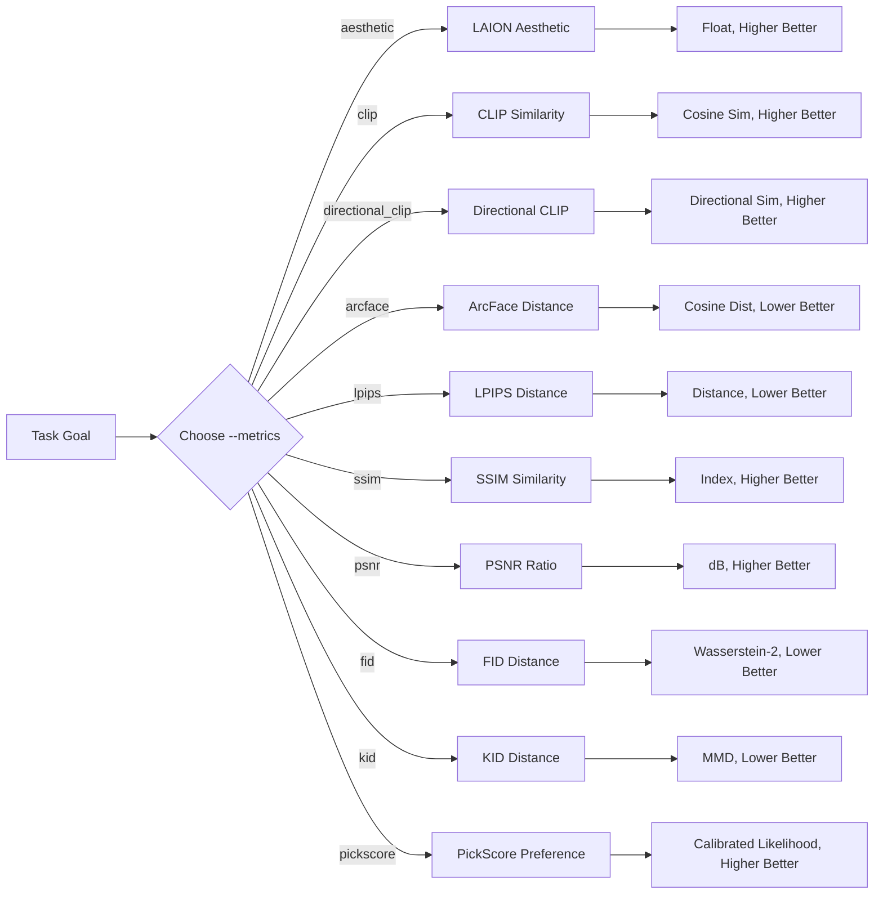

# image-evaluator

`image-evaluator` is a lightweight CLI utility for generative AI practitioners and researchers. It evaluates ten core quality dimensions of synthetic images: predicted visual aesthetics, text-to-image semantic alignment, image editing directional change (Directional CLIP), facial identity preservation, pairwise image fidelity (deep perceptual distance LPIPS, structural similarity SSIM, and peak signal-to-noise ratio PSNR), dataset distribution fidelity (Fréchet Inception Distance FID and Kernel Inception Distance KID), and human preference alignment (PickScore).

## Evaluation Workflow



## Metric Selection

The toolkit registers 10 core metrics backed by an immutable `MetricRegistry`. Each metric provides formal input contracts, task and objective discovery tags, and execution protocols:

| Metric ID | Display Name | Tasks | Objectives | Required Inputs | Direction | Technical Details |
| :--- | :--- | :--- | :--- | :--- | :--- | :--- |
| `aesthetic` | LAION Aesthetic Score | `text_to_image`, `image_editing` | `aesthetic_quality` | `image` | Higher is better | [docs/aesthetic-score.md](docs/aesthetic-score.md) |
| `clip` | CLIP Score | `text_to_image`, `image_editing` | `text_image_alignment` | `image`, `prompt` | Higher is better | [docs/clip-similarity.md](docs/clip-similarity.md) |
| `directional_clip` | Directional CLIP | `image_editing` | `edit_direction_alignment` | `image`, `reference_image`, `prompt`, `source_prompt` | Higher is better | [docs/directional-clip.md](docs/directional-clip.md) |
| `arcface` | ArcFace Distance | `face_generation`, `face_editing` | `identity_preservation` | `image`, `reference_image` | Lower is better | [docs/arcface-distance.md](docs/arcface-distance.md) |
| `lpips` | Learned Perceptual Patch Similarity | `image_editing`, `image_reconstruction`, `super_resolution` | `perceptual_similarity` | `image`, `reference_image` | Lower is better | [docs/pairwise-fidelity.md](docs/pairwise-fidelity.md) |
| `ssim` | Structural Similarity Index Measure | `image_editing`, `image_reconstruction`, `super_resolution` | `structural_similarity` | `image`, `reference_image` | Higher is better | [docs/pairwise-fidelity.md](docs/pairwise-fidelity.md) |
| `psnr` | Peak Signal-to-Noise Ratio | `image_editing`, `image_reconstruction`, `super_resolution` | `pixel_fidelity` | `image`, `reference_image` | Higher is better | [docs/pairwise-fidelity.md](docs/pairwise-fidelity.md) |
| `fid` | Fréchet Inception Distance | `text_to_image`, `unconditional_generation` | `distribution_similarity` | `image_collection`, `reference_collection` | Lower is better | [docs/fid.md](docs/fid.md) |
| `kid` | Kernel Inception Distance | `text_to_image`, `unconditional_generation` | `distribution_similarity` | `image_collection`, `reference_collection` | Lower is better | [docs/kid.md](docs/kid.md) |
| `pickscore` | PickScore | `text_to_image` | `human_preference` | `image`, `prompt` | Higher is better | [docs/pickscore.md](docs/pickscore.md) |

## Quick Start

### Installation

`image-evaluator` requires Python 3.11–3.14. Install the release via pip:

```bash
python -m pip install image-evaluator==0.4.0
```

The supported runtime path is macOS or Linux with CPU ONNX Runtime. Linux
users who want the GPU runtime can replace `onnxruntime` with
`onnxruntime-gpu` after installation. Windows is currently unverified.

### CLI Metric Discovery & Inspection

`image-evaluator` provides instant metric discovery and specification inspection with zero deep-model loading overhead (<20ms response):

1. **List all registered metrics**:
   ```bash
   image-evaluator list
   ```

2. **Filter metrics by task or objective**:
   ```bash
   image-evaluator list --task image_editing
   image-evaluator list --objective pixel_fidelity
   image-evaluator list -t image_reconstruction -o structural_similarity
   ```

3. **Inspect detailed metric specification**:
   ```bash
   image-evaluator show directional_clip
   ```

4. **Structured JSON output for pipeline discovery**:
   ```bash
   image-evaluator list --format json
   image-evaluator show directional_clip --format json
   ```

### Tutorial

The CLI enforces explicit metric selection via `--metrics` and initializes only selected models:
- `--metrics` (required): One or more of `aesthetic`, `clip`, `directional_clip`, `arcface`, `lpips`, `ssim`, `psnr`, `fid`, `kid`, `pickscore`.
- `--image` (required): Path to an image file or directory (must be a directory when `fid` or `kid` is selected).
- `--prompt`: Required when `clip`, `pickscore`, or `directional_clip` is selected; prohibited otherwise.
- `--prompt-src`: Required when `directional_clip` is selected; describes the source image before editing.
- `--reference`: Required when reference-based metrics (`directional_clip`, `arcface`, `lpips`, `ssim`, `psnr`, `fid`, `kid`) are selected; prohibited otherwise (must be a directory when `fid` or `kid` is selected).
- `--format`: Output format, either `text` (default) or `json` (for CI/CD and `jq` pipelines).

1. **Aesthetic evaluation only**:
   ```bash
   image-evaluator --metrics aesthetic --image path/to/image.png
   ```

2. **CLIP text alignment only**:
   ```bash
   image-evaluator --metrics clip --image path/to/image.png --prompt "a cat in oil painting style"
   ```

3. **Pairwise fidelity triad (LPIPS, SSIM, PSNR)**:
   ```bash
   image-evaluator --metrics lpips ssim psnr --image path/to/image.png --reference path/to/ref.png
   ```

4. **Structured JSON output for CI/CD automation**:
   ```bash
   image-evaluator --metrics ssim psnr --image img.png --reference ref.png --format json | jq .metrics.ssim
   ```

5. **Dataset distribution metrics (FID and KID)**:
   ```bash
   image-evaluator --metrics fid kid \
       --reference path/to/real_images/ \
       --image path/to/generated_images/
   ```

6. **PickScore human preference evaluation**:
   ```bash
   image-evaluator --metrics pickscore \
       --image path/to/image.png \
       --prompt "a cat in oil painting style"
   ```

7. **Multi-metric evaluation across folders**:
   ```bash
   image-evaluator --metrics aesthetic clip arcface lpips ssim psnr fid kid pickscore \
       --image path/to/images/ \
       --prompt "a cat in oil painting style" \
       --reference path/to/refs/
   ```

### Python SDK (Zero-Disk-I/O Memory Stream)

For single-image and pairwise metrics (`aesthetic`, `clip`, `directional_clip`, `arcface`, `lpips`, `ssim`, `psnr`, `pickscore`), evaluate in-memory `PIL.Image`, `torch.Tensor`, or `numpy.ndarray` objects directly without saving to disk (dataset metrics `fid` and `kid` require directory paths):

```python
import torch
from image_evaluator import evaluate, evaluate_detailed

t_img = torch.rand(3, 256, 256)
t_ref = torch.rand(3, 256, 256)

# 1. Standard Dictionary Return (100% backward compatible)
scores = evaluate(
    metrics=["ssim", "psnr"],
    image=t_img,
    reference=t_ref,
    device="cpu",
)
print(scores)  # {'ssim': 0.0012, 'psnr': 8.142}

# 2. Detailed Result API (structured result with timing & specs)
result = evaluate_detailed(
    metrics=["ssim", "psnr"],
    image=t_img,
    reference=t_ref,
    device="cpu",
)
print(result["ssim"])              # 0.0012 (Mapping protocol transparent access)
print(result.scores)               # {'ssim': 0.0012, 'psnr': 8.142}
print(result.duration_seconds)     # float: precise execution duration
print(result.to_json())            # RFC 8259 compliant JSON string
```

#### Programmatic Metric Registry Discovery

Inspect registered metric specifications directly without importing heavy model backends:

```python
from image_evaluator.registry import filter_metrics, get_metric, list_metrics

# List all 10 registered metrics (<20ms response, zero heavy imports)
all_metrics = list_metrics()

# Filter metrics by task and objective
editing_metrics = filter_metrics(task="image_editing")
fidelity_metrics = filter_metrics(objective="pixel_fidelity")

# Inspect specification details
spec = get_metric("directional_clip")
print(spec.display_name)       # "Directional CLIP"
print(spec.score_direction)    # "higher_is_better"
print(spec.inputs.required)    # ("image", "reference_image", "prompt", "source_prompt")
```

### Batch Evaluation & Performance Best Practices

When evaluating multiple images, avoid running the CLI in shell loops (`for f in *.png; do ...`), which re-initializes deep models ($N$ times) and introduces massive cold-start friction (~25-35s for 10 images).

Instead, choose between two high-throughput native paradigms:

1. **Native CLI Directory Mode** (Single model initialization, ~2-3s for 10 images):
   ```bash
   image-evaluator --metrics clip --image ./generated/ --prompt "a golden retriever on a sunny lawn"
   image-evaluator --metrics lpips ssim psnr --image ./generated/ --reference ./ground_truth/
   ```

2. **Python Predictor Reuse** (Zero reloading overhead, memory-resident tensors/PIL, ~1.5-2.0s for 10 images):
   ```python
   from PIL import Image
   from image_evaluator import ClipScorePredictor, SSIMPredictor

   # Instantiate once; weights stay resident in memory/VRAM
   clip_pred = ClipScorePredictor(device="cpu")
   ssim_pred = SSIMPredictor()

   # High-throughput in-memory loop
   samples = [("img1.png", "prompt1"), ("img2.png", "prompt2")]
   for path, prompt in samples:
       score = clip_pred.evaluate_clip_score(path, prompt)
   ```

See the full [Task Selection Guide](docs-site/content/docs/guides/task-selection.mdx) and [Batch Performance Guide](docs-site/content/docs/guides/batch-performance.mdx) on the documentation site.

## Interpretation & Protocol Guidelines

1. **Protocol Consistency**: Always compare scores under identical model backbones and preprocessing pipelines.
2. **Relative Comparison**: Avoid universal absolute thresholds; interpret scores relative to a baseline control.
3. **Fail-Fast Spatial Dimension Policy**: Pairwise metrics (`lpips`, `ssim`, `psnr`) strictly reject mismatched image dimensions with `ValueError` to prevent artificial interpolation distortion. Align sizes beforehand via downsampling or super-resolution.
4. **SSIM Minimum Size**: SSIM requires both image dimensions to be at least 11 pixels because it uses the documented 11 × 11 Gaussian window. Smaller inputs fail with `ValueError`.
5. **Dataset Distribution Contract**: Both `fid` and `kid` require existing directories on both sides; passing single files is rejected immediately. Neither metric requires filename stem matching ($N_{\text{ref}} \ne N_{\text{gen}}$ is allowed).
6. **Sample Size Sensitivity & Unbiasedness**: FID is a biased estimator with finite-sample bias that increases significantly on smaller sample sizes (triggering a `UserWarning` reminding users of finite-sample sensitivity). KID is an unbiased U-statistic estimator that can produce small negative values near zero; these reflect normal statistical fluctuations and must not be truncated. KID defaults to deterministic `seed=0` for bit-exact reproducibility.
7. **Human Preference Alignment**: PickScore assesses text-image alignment against trained human preference choices from the Pick-a-Pic dataset (`yuvalkirstain/PickScore_v1`). Scores are uncalibrated logits where higher scores indicate stronger preference; win rate is evaluated strictly via the sigmoid difference between candidate pairs conditioned on identical prompts. PickScore strictly requires an explicit text prompt (`--prompt`).

## Release Status

| Area | `0.3.0` status |
| :--- | :--- |
| Metrics | Aesthetic, CLIP, ArcFace, LPIPS, SSIM, PSNR, FID, KID, PickScore |
| macOS | Verified on Apple Silicon with Python 3.11 |
| Linux | Clean install and test suite verified on GitHub Actions with Python 3.11 |
| Windows | External Python 3.12 smoke test passed for CLIP, LPIPS, SSIM, and PSNR; full support remains unverified |
| Dataset metrics | FID and KID fully implemented via clean-fid 0.1.35 under clean Inception-v3 protocol with deterministic seed=0 |
| Human preference | PickScore fully implemented via PickScore_v1 (yuvalkirstain/PickScore_v1) with calibrated likelihood logits |

See [CHANGELOG.md](CHANGELOG.md) for the accepted user-facing changes and
known limitations.
