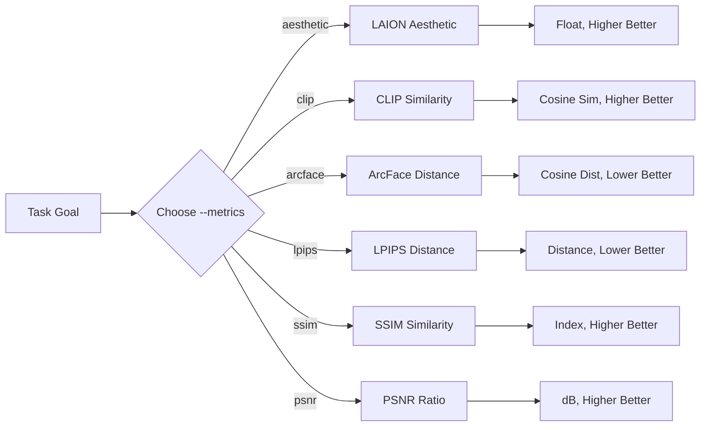

# image-evaluator

`image-evaluator` is a lightweight CLI utility for generative AI practitioners and researchers. It evaluates six core quality dimensions of synthetic images: predicted visual aesthetics, text-to-image semantic alignment, facial identity preservation, and pairwise image fidelity (deep perceptual distance LPIPS, structural similarity SSIM, and peak signal-to-noise ratio PSNR).

## Evaluation Workflow



## Metric Selection

| Target Goal | Metric Name | Required Options | Output Direction | Technical Details |
| :--- | :--- | :--- | :--- | :--- |
| Visual appeal & quality | `aesthetic` | `--image` | Higher is better | [docs/aesthetic-score.md](docs/aesthetic-score.md) |
| Prompt semantic match | `clip` | `--image`, `--prompt` | Higher is better | [docs/clip-similarity.md](docs/clip-similarity.md) |
| Facial identity consistency | `arcface` | `--image`, `--reference` | Lower is better | [docs/arcface-distance.md](docs/arcface-distance.md) |
| Deep perceptual similarity | `lpips` | `--image`, `--reference` | Lower is better | [docs/pairwise-fidelity.md](docs/pairwise-fidelity.md) |
| Structural degradation | `ssim` | `--image`, `--reference` | Higher is better | [docs/pairwise-fidelity.md](docs/pairwise-fidelity.md) |
| Pixel reconstruction SNR | `psnr` | `--image`, `--reference` | Higher is better | [docs/pairwise-fidelity.md](docs/pairwise-fidelity.md) |

## Quick Start

### Installation

`0.1.0a1` is an alpha preview and requires Python 3.11–3.14. Install the
preview explicitly because package installers normally exclude prereleases:

```bash
python -m pip install --pre image-evaluator==0.1.0a1
```

The supported runtime path is macOS or Linux with CPU ONNX Runtime. Linux
users who want the GPU runtime can replace `onnxruntime` with
`onnxruntime-gpu` after installation. Windows is currently unverified.

### Tutorial

The CLI enforces explicit metric selection via `--metrics` and initializes only selected models:
- `--metrics` (required): One or more of `aesthetic`, `clip`, `arcface`, `lpips`, `ssim`, `psnr`.
- `--image` (required): Path to an image file or directory.
- `--prompt`: Required when `clip` is selected; prohibited otherwise.
- `--reference`: Required when reference-based metrics (`arcface`, `lpips`, `ssim`, `psnr`) are selected; prohibited otherwise.

1. **Aesthetic evaluation only**:
   ```bash
   image-evaluator --metrics aesthetic --image path/to/image.png
   ```

2. **CLIP text alignment only**:
   ```bash
   image-evaluator --metrics clip --image path/to/image.png --prompt "a cat in oil painting style"
   ```

3. **Pairwise fidelity triad (LPIPS, SSIM, PSNR)**:
   ```bash
   image-evaluator --metrics lpips ssim psnr --image path/to/image.png --reference path/to/ref.png
   ```

4. **Multi-metric evaluation across folders**:
   ```bash
   image-evaluator --metrics aesthetic clip arcface lpips ssim psnr \
       --image path/to/images/ \
       --prompt path/to/prompts/ \
       --reference path/to/refs/
   ```

## Interpretation & Protocol Guidelines

1. **Protocol Consistency**: Always compare scores under identical model backbones and preprocessing pipelines.
2. **Relative Comparison**: Avoid universal absolute thresholds; interpret scores relative to a baseline control.
3. **Fail-Fast Spatial Dimension Policy**: Pairwise metrics (`lpips`, `ssim`, `psnr`) strictly reject mismatched image dimensions with `ValueError` to prevent artificial interpolation distortion. Align sizes beforehand via downsampling or super-resolution.
4. **SSIM Minimum Size**: SSIM requires both image dimensions to be at least 11 pixels because it uses the documented 11 × 11 Gaussian window. Smaller inputs fail with `ValueError`.

## Preview Status

| Area | `0.1.0a1` status |
| :--- | :--- |
| Metrics | Aesthetic, CLIP, ArcFace, LPIPS, SSIM, PSNR |
| macOS | Verified on Apple Silicon with Python 3.11 |
| Linux | Release validation pending |
| Windows | Unverified |
| Dataset metrics | FID/KID planned for M4; not included |

See [CHANGELOG.md](CHANGELOG.md) for the accepted user-facing changes and
known preview limitations.
